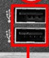
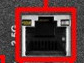
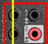
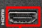
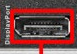

# Conectores externos

#### Esta placa base cuenta con conectores USB 3.2, USB 2.0, Ethernet, Audio Ports, HDMI, DisplayPort.

## USB 3.2

**El USB tipo c:** se usa para conector dispositivos como mobiles, discos duros, etc. Tiene sus ventajas al ser reversible y es muy rapido.

**USB azules y rojos:** Los colores no importan mucho solo indican la version que son, estos USB se usan para periféricos que requieren alta velocidad como discos externos, pendrives rápidos, etc.

## USB 2.0

Los USB 2.0 se Usan para conectar periféricos básicos como un ratón, teclado, impresora, etc. Esto es ideal para dispositivos que no necesitan mucha velocidad.

## Ethernet

Los puertos de ethernet son bastante basicos, es para conectar el cable de Ethernet RJ-45 y sirve para poder conectoar el PC a internet y va mucho mas rapido que el wifi y tambien es mas estable.

## Audio Ports

 Su uso es conectar altavoces, micrófonos y auriculares. Los colores mas comunes son el Verde: Salida de audio, el Rosa: Entrada de micrófono y el Azul: Entrada de línea.

 ## HDMI
 

El uso del HDMI es conectar pantallas o televisores. Las ventajas serian que con un solo cable se puede transmitir imagen y sonido sin problema.

## DisplayPorts

Se Usa para conectar monitores modernos, se dice que es mejor que HDMI hablando de PCs. Este si que tiene mas ventajas, soporta mayores tasas de refresco y resoluciones asi puedes difrutar de una mejor experiencia i que se refresque mas rapido.
