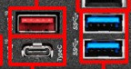

# Conectores externos

#### Esta placa base cuenta con conectores USB 3.2, USB 2.0, Ethernet, Audio Ports, HDMI, DisplayPort.

## USB 3.2

**El USB tipo c:** se usa para conector dispositivos como mobiles, discos duros, etc. Tiene sus ventajas al ser reversible y es muy rapido.
**USB azules y rojos:** Los colores no importan mucho solo indican la version que son, se usan para periféricos que requieren alta velocidad (discos externos, pendrives rápidos, etc.).
